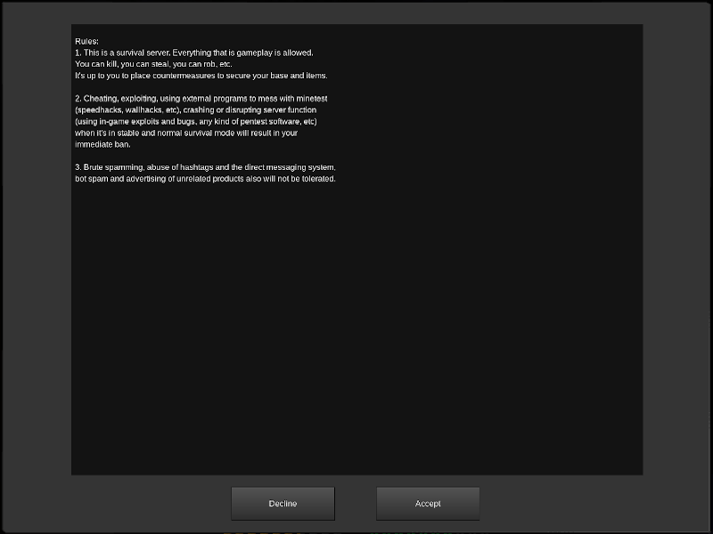

# welcome_screen
A simple welcome screen mod.

## Overview
The mod displays a welcome window with (rules, information, anything you like) to new players and asks them to accept (or decline) it.  
Players who decline it are not granted privileges specified in the mod configuration.  

## Requirements

- Minetest 0.4.16+
- Minetest_game 0.4.16+
- [sfinv_buttons](https://repo.or.cz/minetest_sfinv) (optional, adds a button to the sfinv menu if present)

## Installation
- Navigate to the mod folder, copy and rename "rules.lua_example" file to "rules.lua" file so your changes would persist at updates.
- Adjust rules.lua file to your liking (change list of granted privileges, adjust the text itself, etc).
- Adjust default_privs variable in your minetest server config and remove all the privileges you want to be granted when a player accepts the rules. (example: default_privs = shout)

## Usage
Any players who are missing at least one privilege from a list, specified in rules.lua (see installation section) will be prompted with a rules window upon login.  

Accepting the rules will grant them these privileges. Declining it will allow them to roam the server without interacting and having other privileges you specified.  

The window can be summoned again at any time with "/rules" command. Players who already have all the privileges listed in the config file still can summon this window without accepting the rules for the second time.  

## License
All code is GPLv3 [link to the license](https://www.gnu.org/licenses/gpl-3.0.en.html)  
All resources not covered in the "credits" section are licensed under CC BY 4.0 [link to the license](https://creativecommons.org/licenses/by/4.0/legalcode)  